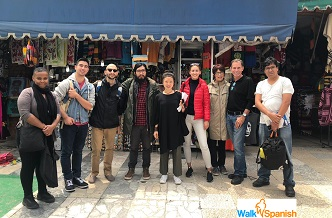

# spanishschoolinmexicocity
Spanish language school in mexico city

Recently we had to the chance of taking a Spanish course in Mexico City at a local Spanish school named Walk Spanish. We did some school shopping of course before selecting this language school and we must say we were more than happy to choose this option for our language studies! The school offers Spanish language courses in an outside of the classroom environment which means in cafeterias, museums, parks and more in the top neighborboods such as Polanco, Roma and Condesa. 
### This [Mexico City Spanish Language School](https://www.walkspanish.com) has, in our opinion, revolutionized the Spanish language learning methodology. 
Some pictures of our teachers and students below.

The main reasons for choosing this school were:
1. Different methodology since we could learn Spanish in a classroom at home
2. We wanted to make the most of our time so we wanted to learn Spanish and explore Mexico City
3.We found the neighborhoods used Polanco, Roma and Condesa to be the safest and best neighborhoods in the city

We would definitely recommend anyone to learn Spanish in Mexico City with Walk Spanish
